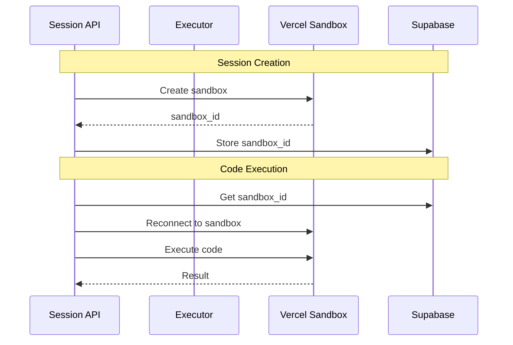

# Live Coding Classroom

A real-time web-based coding tool for classroom instruction. Instructors create classes and sections, students join via codes, and everyone participates in live coding sessions with real-time synchronization.

## Key Features

- **Class & Section Management** - Organize courses with multiple sections (by semester, time slot)
- **Live Coding Sessions** - Real-time code sync via Supabase Realtime
- **Code Execution** - Server-side Python execution with output capture
- **Monaco Editor** - VS Code-powered editor with syntax highlighting
- **AI Walkthrough** - Gemini-powered analysis of student submissions
- **Problem Library** - Reusable problems with starter code
- **Multi-Tenancy** - Namespace isolation with RBAC

## Tech Stack

- **Frontend**: Next.js 15, React 19, TypeScript, Tailwind CSS
- **Backend**: Next.js API routes, Supabase (PostgreSQL + Auth + Realtime)
- **Editor**: Monaco Editor
- **Code Execution**: Vercel Sandbox (production) / nsjail (local dev) with Python 3.13
- **Testing**: Jest, Playwright (E2E)

## Quick Start

```bash
# 1. Clone and install
git clone https://github.com/jdelfino/coding-tool.git
cd coding-tool
npm install

# 2. Start local Supabase
npx supabase start

# 3. Configure environment (copy keys from supabase start output)
cp .env.example .env.local
# Edit .env.local with your Supabase keys

# 4. Reset database with seed data
npx supabase db reset

# 5. Start dev server
npm run dev
```

**Access the app:**
- App: http://localhost:3000
- Supabase Studio: http://localhost:54323
- Test login: `admin@test.local` / `password123`

## Environment Variables

| Variable | Description |
|----------|-------------|
| `NEXT_PUBLIC_SUPABASE_URL` | Supabase API URL |
| `NEXT_PUBLIC_SUPABASE_PUBLISHABLE_KEY` | Supabase publishable key (safe for browser) |
| `SUPABASE_SECRET_KEY` | Supabase secret key (server-only) |
| `SYSTEM_ADMIN_EMAIL` | Email auto-promoted to system-admin |
| `GEMINI_API_KEY` | (Optional) For AI Walkthrough feature |

## Development

```bash
npm run dev           # Start dev server
npm test              # Run all tests
npm run test:e2e      # Run Playwright E2E tests
npm run lint          # Run ESLint
npx tsc --noEmit      # Type check
```

## Architecture Overview

```
Namespace (organization)
└── Class (e.g., CS 101)
    └── Section (e.g., Fall 2025 Section A)
        ├── Instructors
        ├── Students (join via code)
        └── Sessions (live coding)
```

**Roles**: `system-admin` → `namespace-admin` → `instructor` → `student`

**Data Flow**: Student types → Supabase Realtime → Instructor dashboard

## Code Execution Architecture

Python code execution uses environment-based sandboxing:

| Environment | Sandbox | Description |
|-------------|---------|-------------|
| Local (dev) | nsjail | Linux namespace isolation for development |
| Vercel | Vercel Sandbox | Cloud-based sandbox with Python 3.13 runtime |
| Testing | None | `DISABLE_SANDBOX=true` for unit tests |

### Vercel Sandbox Integration



**Key design decisions:**
- **Eager sandbox creation**: Sandbox is created when the session starts (not on first execution), eliminating cold-start delays
- **Sandbox persistence**: Sandbox IDs are stored in Supabase (`session_sandboxes` table) for reconnection across serverless invocations
- **Automatic recreation**: If a sandbox times out (45 min on Hobby plan), it's recreated transparently on next execution
- **Graceful degradation**: Sandbox failures return clear error messages; code never runs unsandboxed

**Environment variables for Vercel:**
- `VERCEL` - Auto-set by Vercel, triggers Vercel Sandbox mode
- `DISABLE_SANDBOX` - Disable sandboxing entirely (testing only, never in production)

### Observability

Sandbox operations emit structured JSON logs for monitoring:

```json
{"timestamp":"...","service":"vercel-sandbox","event":"sandbox_create","sessionId":"...","durationMs":523,"success":true}
{"timestamp":"...","service":"vercel-sandbox","event":"sandbox_execute","sessionId":"...","durationMs":234,"success":true}
```

Events: `sandbox_create`, `sandbox_reconnect`, `sandbox_recreate`, `sandbox_execute`, `sandbox_trace`, `sandbox_cleanup`

### Rate Limiting (Vercel)

Configure IP-based rate limiting in the Vercel Dashboard:

1. Go to **Project Settings** → **Firewall**
2. Create a rate limiting rule:
   - **Match**: Path starts with `/api/sessions/` AND ends with `/execute` or `/trace`
   - **Rate limit**: 60 requests per minute per IP
   - **Action**: Challenge or Block

This protects against abuse without requiring application-level rate limiting code.

## Project Structure

```
src/
├── app/                    # Next.js pages and API routes
│   ├── api/               # REST API endpoints
│   ├── instructor/        # Instructor dashboard
│   ├── student/           # Student interface
│   └── admin/             # Admin panels
├── server/                # Backend logic
│   ├── persistence/       # Supabase repositories
│   ├── auth/             # Authentication & RBAC
│   └── services/         # Business logic
└── hooks/                 # React hooks
```

## Documentation

- **[User Guide](docs/USER_GUIDE.md)** - End-user documentation
- **[Setup Guide](docs/SETUP.md)** - Detailed setup instructions
- **[Authentication](docs/AUTHENTICATION.md)** - Auth system details
- **[CLAUDE.md](CLAUDE.md)** - AI agent instructions
- **[AGENTS.md](AGENTS.md)** - Development workflows

## Contributing

1. Fork the repository
2. Create a feature branch
3. Write tests for your changes
4. Run `npm test && npm run lint && npx tsc --noEmit`
5. Submit a Pull Request

## License

ISC License - see [LICENSE](LICENSE)
